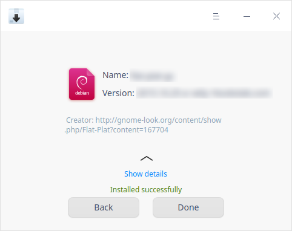
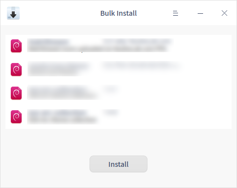
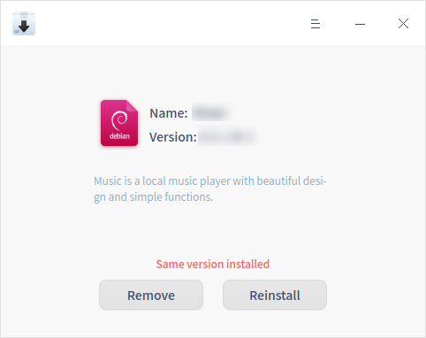

# Package Installer|deepin-deb-installer|

## Overview

Package Installer is an easy-to-use .deb package and .uab package management tool with a simple interface for users to quickly install customized applications not included in App Store supporting bulk installation, version identification and auto completion of dependencies.  

## Operations

### Run Package Installer

You can open Package Installer as follows:

- Double click a .deb package or a .uab package to run.
- Click the icon of Package Installer from Launcher to run. 

### Install

Package Installer is capable to install an individual application or multiple applications.

#### Singularly Install

1. On Package Installer interface, you can:
   - click **Select File**, select the package you want to install, click **Open**. 
   - drag package directly into the interface.
2. Click **Install**. Authentication window pops up, enter your login password required to continue.
3. Click  or  to display or collapse the installing process during installation.
4. Click **Back** to keep on adding more packages or click **OK** to exit.

>  Notes: If the installed package is detected to be the newer version, the **Downgrade** button will be displayed for you to return it to the older version; if the installed package is detected to be the lower version, the **Update** button will be displayed for you to update.

#### Bulk Install

To install multiple packages at a time, you can click **Select File** or drag files into Package Installer. Please refer to [Singularly Install](#Singularly Install) for operation steps. Pay attention to the following:

- You can view installing process when multiply installing.
- Only **Install** button is displayed in the window. Installation would be done for packages of those other versions have been installed locally before. Re-installation would be done for packages of those the same versions have been installed locally before.
- To remove a package from the list, right-click it and select **Delete**. 

#### Unable to Install

Package Installer is able to identify the packages could not be installed automatically, which effectively avoids the problem that they cannot be used after installation.

Please read the prompt carefully, common causes include: 

- Unmatched package architecture. 
  
- Broken dependencies.
  

### Uninstall

Package Installer is used to uninstall packages of those the same or different versions have been installed already. 

1. On Package Installer interface, you can:
   - click **Select File**, select the package you want to install, click **Open**. 
   - drag a package directly into the interface.
2. Click **Remove**.
3. Click **Confirm** to uninstall. Authentication window pops up, enter your login password required to continue.
4. Click  or  to display or collapse the uninstalling process during uninstallation.
5. Click **OK** to exit.

>  Attention: The system or other applications would be affected if you have uninstalled some applications. Please operate carefully. 

## Main Menu

In the main menu, you can switch window themes, view manual and get more information about Package Installer.

### Settings

1. Click  on the interface.
2. Click **Settings**.
3. To install unsigned applications, click **Security Center > Security Tools > Application Security** to jump to the Security Center app for configuration.  

### Theme

The window theme includes Light Theme, Dark Theme and System Theme.

1. Click  on the interface.
2. Click **Theme** to select a theme.

### Help

You can click to view the manual, which will help you further know and use Package Installer.

1. Click  on the interface.
2. Click **Help**.
3. View the manual.

### About

1. Click  on the interface.
2. Click **About**.
3. View the version description.

### Exit

1. Click  on the interface.
2. Click **Exit**.
