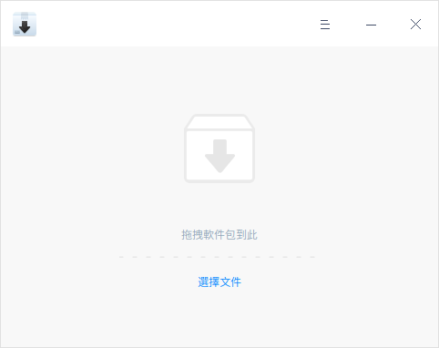
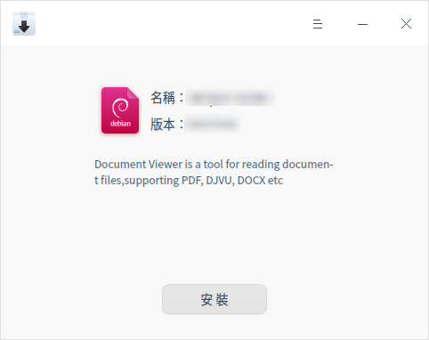
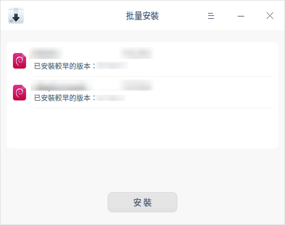
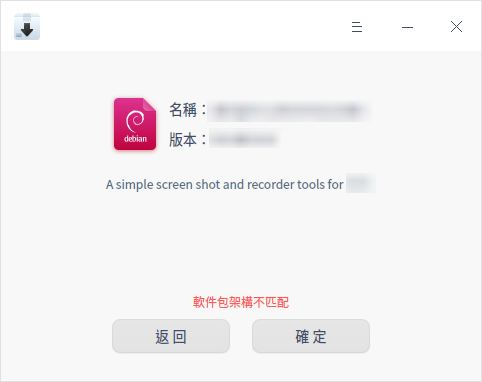
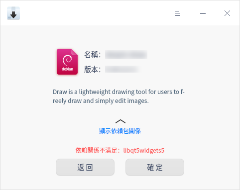
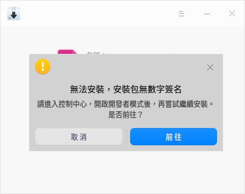
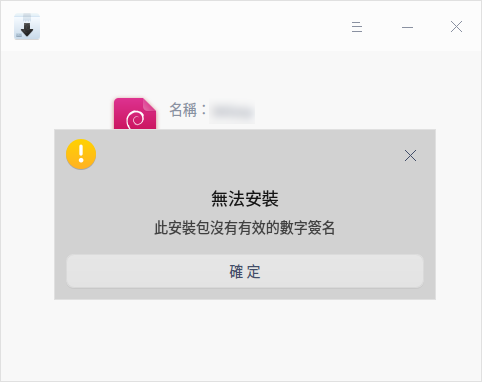
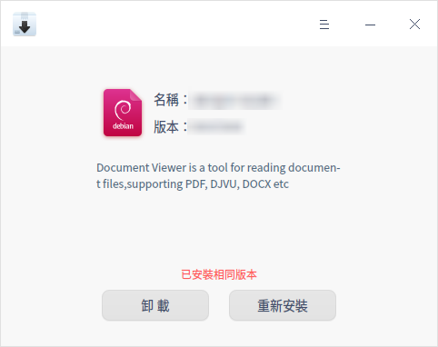

# 軟件包安裝器|deepin-deb-installer|

## 概述

軟件包安裝器是一款deb包和uab包管理工具，界面簡單易用，支持批量安裝、版本訊息識別和依賴包自動補全等功能，以幫助您快速的實現安裝操作。

## 操作介紹

### 打開方式

您可以使用以下方法打開軟件包安裝器：

- 雙擊deb包或uab包，軟件包安裝器會自動啟動並準備安裝該軟件包。
- 直接將deb包或uab包拖拽到圖標上打開應用。

### 安裝

軟件包安裝器可以安裝單個應用，也可以批量安裝多個應用。

#### 單個安裝

1.  在軟件包安裝器界面，您可以：
   - 單擊 **選擇文件** ，選擇需要安裝的軟件包，單擊 **打開**。
   - 直接將軟件包拖拽到應用界面。
2.  單擊 **安裝**，彈出授權窗口，請輸入密碼授權。
3.  安裝過程中可以單擊  或  展開或收起安裝進程訊息。
4.  安裝成功之後，單擊 **完成** 退出，或者單擊 **返回** 繼續安裝其他應用。

   

>  說明：當檢測到已安裝的軟件版本高於或低於待安裝的版本時，界面會顯示 **安裝舊版本** 或 **更新** 按鈕，您可以根據需要退回到舊版本或更新到新版本。  

#### 多個安裝

軟件包安裝器可以通過拖拽和選擇文件的方式一次性批量添加多個軟件包，安裝步驟請參考 [單個安裝](#單個安裝)，多個安裝時請注意以下要點：

- 批量安裝同樣也可以查看安裝進程。
- 批量安裝時按鈕只顯示 **安裝** 按鈕。本地已安裝其他版本的軟件包執行安裝操作，本地已安裝相同版本的軟件包執行重新安裝操作。
- 批量安裝列表內，選擇一個安裝包，單擊鼠標右鍵選擇 **刪除** 可將安裝包從安裝列表移除。

#### 無法安裝

軟件包安裝器可以自動識別無法安裝的包，有效規避安裝後無法使用的問題。

常見的原因有：

- 軟件包架構不匹配。

- 依賴關係不滿足。

- 安裝包無數字簽名。

- 安裝包沒有有效的數字簽名。

### 卸載

當安裝包已存在相同或其他版本時，可以使用軟件包安裝器執行卸載操作。

1.  在軟件包安裝器界面，您可以：
   - 單擊 **選擇文件** ，選擇需要安裝的軟件包，單擊 **打開**。
   - 直接將軟件包拖拽到應用界面。
2. 單擊 **卸載**。
3. 請注意界面上的卸載提示，單擊 **確定卸載**，彈出授權窗口，請輸入密碼授權。
4. 卸載過程中可以單擊  或  展開或收起卸載進程訊息。
5. 卸載成功後單擊 **完成**。

>  注意：卸載某些應用可能會對系統或其他軟件產生影響，請謹慎操作。

## 主菜單

在主菜單中，您可以切換窗口主題、查看幫助手冊，了解軟件包安裝器的更多訊息。

### 設置

1. 在軟件包安裝器界面，單擊 。
2. 選擇 **設置**。
3. 勾選 **開發者模式下，檢測安裝包的簽名**，安裝軟件包時將檢測安裝包有無簽名及簽名是否有效。

### 主題

窗口主題包含淺色主題、深色主題和系統主題。

1. 在軟件包安裝器界面，單擊 。
2. 選擇 **主題**，選擇一個主題顏色。

### 幫助

查看幫助手冊，進一步了解和使用軟件包安裝器。

1. 在軟件包安裝器界面，單擊 。
2. 選擇 **幫助**。
3. 查看軟件包安裝器的幫助手冊。

### 關於

1. 在軟件包安裝器界面，單擊 。
2. 選擇 **關於**。
3. 查看軟件包安裝器的版本和介紹。

### 退出

1. 在軟件包安裝器界面，單擊 。
2. 選擇 **退出**。

