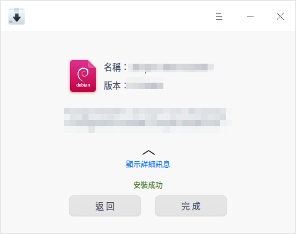
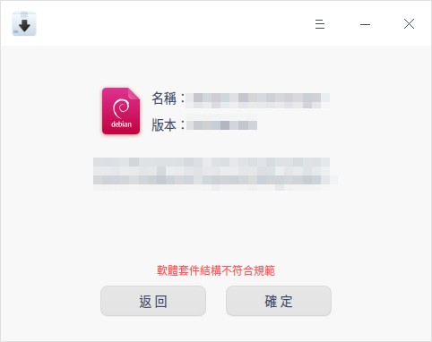
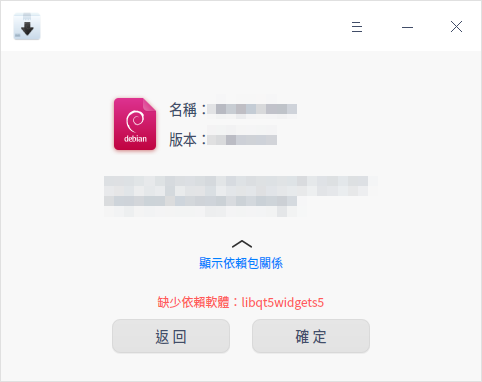

# 軟體包安裝器|deepin-deb-installer|

## 概述

軟體包安裝器是一款deb包管理工具，介面簡單易用，支援批次安裝、版本訊息識別和依賴包自動補全等功能，以幫助您快速的實現安裝操作。

## 操作介紹

### 開啟方式

您可以使用以下方法打開軟體包安裝器：

- 雙擊deb包，軟體包安裝器會自動啟動並準備安裝該軟體包。
- 直接將deb包拖曳到軟體包安裝器的圖示上打開應用。

### 安裝

軟體包安裝器可以安裝單個應用，也可以批次安裝多個應用。

#### 單個安裝

1. 在軟體包安裝器介面，您可以：
   - 單擊 **選擇檔案** ，選擇需要安裝的軟體包，單擊 **開啟**。
   - 直接將軟體包拖曳到應用介面。
2. 單擊 **安裝**。彈出授權視窗，請輸入密碼授權。
3. 安裝過程中可以單擊  或  展開或收起安裝程式訊息。
4.  安裝成功之後，單擊 **完成** 退出，或者單擊 **返回** 繼續安裝其他應用。

>  說明：當檢測到已安裝的軟體版本高於或低於待安裝的版本時，介面會顯示 **安裝舊版本** 或 **更新** 按鈕，您可以根據需要退回到舊版本或更新到新版本。

&nbsp;&nbsp;&nbsp;&nbsp;&nbsp;&nbsp;&nbsp;&nbsp;&nbsp;&nbsp;&nbsp;&nbsp;&nbsp;

#### 多個安裝

軟體包安裝器可以透過拖曳和選擇檔案的方式一次性批次添加多個軟體包，安裝步驟請參考 [單個安裝](#單個安裝)，多個安裝時請注意以下要點：

- 批次安裝同樣也可以查看安裝程式。
- 批次安裝時按鈕只顯示 **安裝** 按鈕。本機已安裝其他版本的軟體執行安裝操作，本機已安裝相同版本的軟體執行重新安裝操作。
- 批次安裝列表內，選擇一個安裝包，單擊滑鼠右鍵選擇 **刪除** 可將安裝包從安裝列表移除。

#### 無法安裝

軟體包安裝器可以自動識別無法安裝的包，有效規避安裝後無法使用的問題。

常見的原因有：

- 軟體套件結構不符合規範。

- 缺少依賴軟體。

### 移除

當一個安裝包在您的電腦上已存在相同或其他版本時，可以使用軟體包安裝器執行移除操作。

1. 在軟體包安裝器介面，您可以：

   - 單擊 **選擇檔案** ，選擇需要安裝的軟體包，單擊 **開啟**。
   - 直接將軟體包拖曳到應用介面。
2. 單擊 **移除**。
3. 單擊 **確認移除**。彈出授權視窗，請輸入密碼授權。
4. 移除過程中可以單擊  或  展開或收起移除程式訊息。
5. 移除成功後單擊 **完成**。

&nbsp;&nbsp;&nbsp;&nbsp;&nbsp;&nbsp;&nbsp;&nbsp;&nbsp;&nbsp;&nbsp;&nbsp;&nbsp;

>  注意：移除某些應用可能會對系統或其他軟體產生影響，請謹慎操作。

## 主選單

在主選單中，您可以切換視窗主題、查看說明手冊，了解軟體包安裝器的更多訊息。

### 主題

視窗主題包亮色主題、暗色主題和系統主題。

1. 在軟體包安裝器介面，單擊 。
2. 單擊 **主題**，選擇一個主題顏色。

### 說明

查看說明手冊，讓您進一步了解和使用軟體包安裝器。

1. 在軟體包安裝器介面，單擊 。
2. 單擊 **說明**。
3. 查看軟體包安裝器的說明手冊。

### 關於

1. 在軟體包安裝器介面，單擊 。
2. 單擊 **關於**。
3. 查看軟體包安裝器的版本和介紹。

### 退出

1. 在軟體包安裝器介面，單擊 。
2. 單擊 **退出**。

