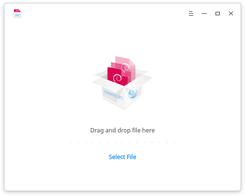
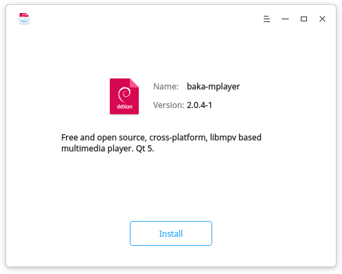
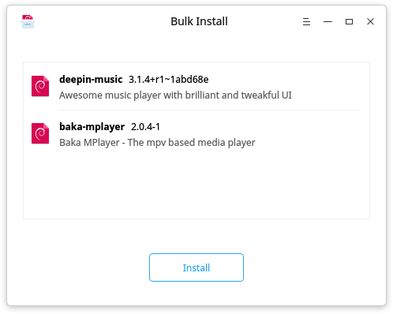
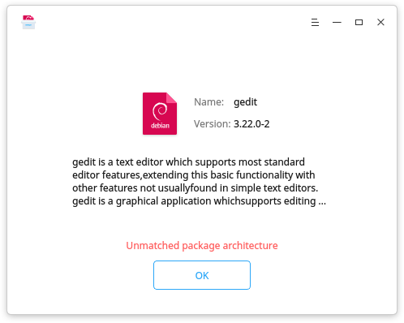
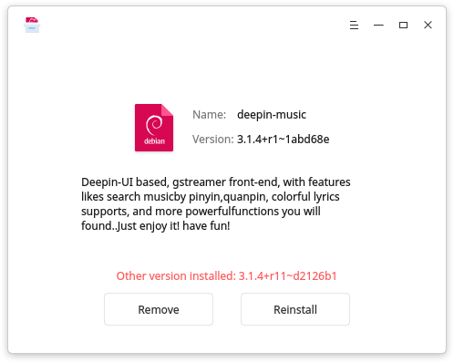
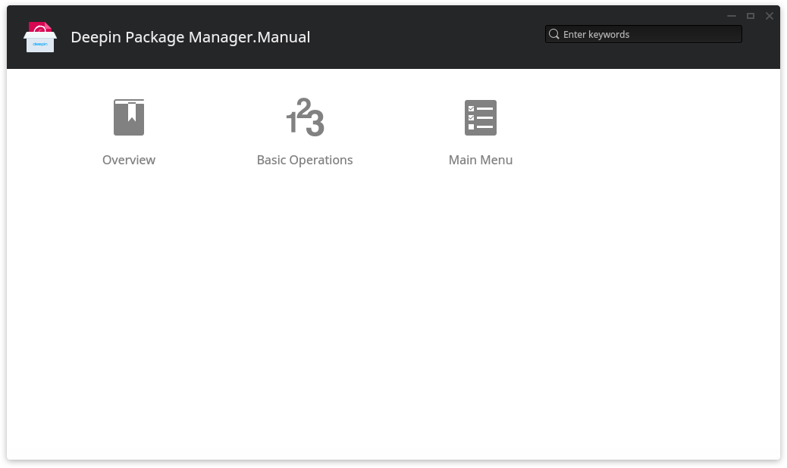

# Deepin Package Manager |../common/deepin-deb-installer-48px.svg|

## Overview|../common/icon_overview.svg|

Deepin Package Manager is an application used to help users install and remove local software, supports bulk install.

## Basic Operations|../common/icon_commoncoperat.svg|

### Run Deepin Package Manager

- Double click on a .deb package to run.
- Click on the icon of Deepin Package Manager to run.

### Single Install

1. On Deepin Package Manager interface, click on **Select File** to add a .deb package.
2. The application will detect the package status:
   - Newly installed, select **Install** to continue.
   - Other version installed, select **Renstall** to continue or **Remove** to uninstall.
3. Password required to continue when clicking on **Install** or **Renstall**.
4. Click on  or  to display or collapse the installing process.
5. Click on **Back** to newly add or click on **OK** to exit.

> : You can also drag and drop file to Deepin Package Manager to add.

### Bulk Install

1. On Deepin Package Manager interface, click on **Select File** to add .deb packages.
2. Click on the top right Delete button if you want to delete one.
3. Password required to continue when clicking on **Install**.
4. Click on  or  to display or collapse the installing process.
5. The installation status will be displayed on the right of each package, such as installed, installing and failed.
6. Click on **Back** to newly add or click on **OK** to exit.

> : No more file can be added after you successfully added multiple files in one time.

### Unable to Install

1. On Deepin Package Manager interface, click on **Select File** to add a .deb package.
2. View the reason unable to install: broken dependencies or unmatched package architecture.
3. Click on **Back** to newly add or click on **OK** to exit.

### Uninstall

1. On Deepin Package Manager interface, click on **Select File** to add a .deb package.
2. The application will detect the package status:
   - Newly installed, select **Install** to continue.
   - Other version installed, select **Renstall** to continue or **Remove** to uninstall.
3. Click on **Remove**, then there will be a prompt and click on **Confirm** to unistall.
4. Click on  or  to display or collapse the uninstall process.
5. Click on **Back** to newly add or click on **OK** to exit.

## Main Menu|../common/icon_optionsetting.svg|

### Help

You can click to view the manual, which will help you further know and use Deepin Package Manager.

1. On Deepin Package Manager interface, click on .
2. Click on **Help**.
3. View the manual.

### About

You can click to view the version description.

1. On Deepin Package Manager interface, click on .
2. Click on **About**.
3. View the version description.

### Exit

You can click to exit Deepin Package Manager.

1. On Deepin Package Manager interface, click on .
2. Click on **Exit** to exit.
