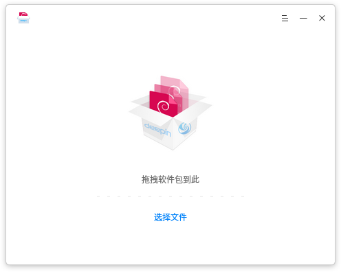
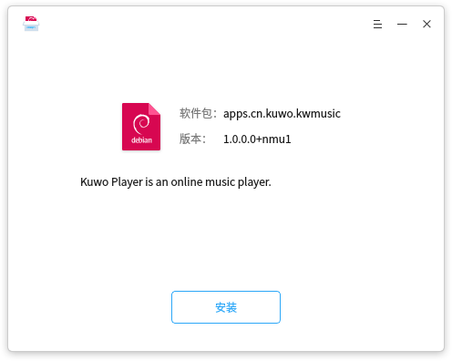
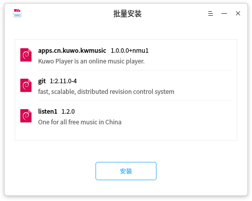
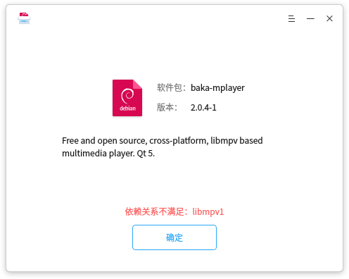
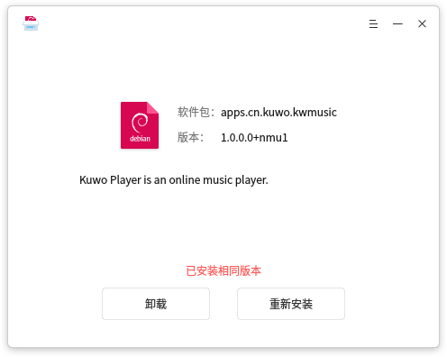
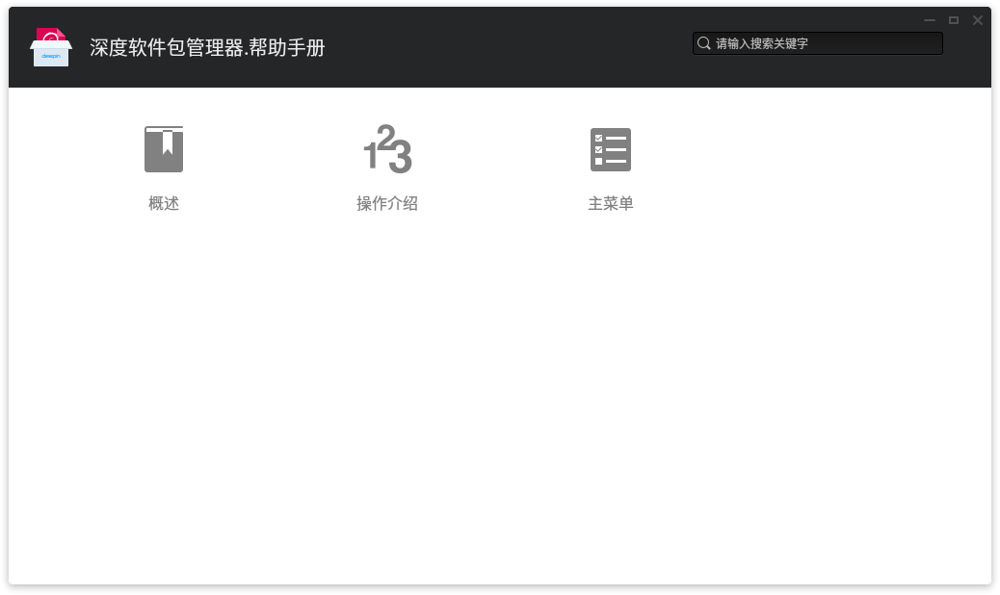
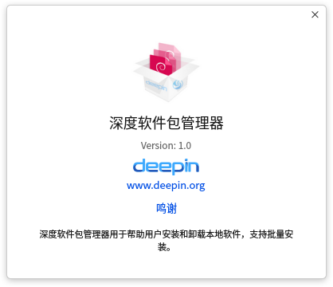

# 深度软件包管理器|../common/deepin-deb-installer-48px.svg|

## 概述|../common/icon_overview.svg|

深度软件包管理器是一款deb包管理工具，方便用户安装商店以外的自定义应用。界面简单易用，支持批量安装、版本信息识别和依赖自动补全等功能，只要您获取正确的deb包就能快速地安装在深度操作系统上。

## 操作介绍|../common/icon_commoncoperat.svg|

### 打开方式

您可以使用一下方法打开深度软件包管理器：

- 使用鼠标双击deb包，深度软件包管理器会自动启动并准备安装该软件包。
- 从启动器中点击应用图标，深度软件包管理器启动后可以选择文件或者直接将deb包拖拽到界面上。

### 安装

深度软件包管理器可以安装单个应用，也可以批量安装多个应用。

#### 单个安装

1.  在深度软件包管理器界面，点击 **选择文件** 。
2.  选择需要安装的软件包，点击 **打开**。
3.  点击 **安装**。
4.  如果弹出授权窗口，请输入密码授权。
5.  安装过程中可以点击 或展开或收起安装进程信息。
6.  安装成功之后，点击 **完成** 退出，或者点击 **返回** 继续安装其他应用。
  

>:深度软件包管理器会自动检测您的安装包，如果本地已经安装过该应用，会显示已安装和准备安装的版本信息，此时可以选择 **卸载** 或 **重新安装** 操作。

#### 多个安装

深度软件包管理器可以通过拖拽和选择文件的方式一次性批量添加多个软件包，安装步骤请参考 [单个安装](单个安装)，多个安装时请注意一下要点：

- 批量添加成功后不能继续追加。
- 批量安装同样也可以查看安装进程。
- 批量安装时按钮只显示 **安装** 按钮。本地已安装其他版本的软件包执行安装操作，本地已安装相同版本的软件包执行重新安装操作。
- 批量安装时将鼠标移动到一个应用栏上，可以点击应用行右侧的×将该安装包从安装列表移除。

#### 无法安装

深度软件包管理器可以自动识别无法安装的包，有效规避安装后无法使用的问题。

请留意界面提示并确定，常见的原因有：

- 软件包架构不匹配。
- 依赖关系不满足。

### 卸载

当一个安装包在您的计算机上已存在相同或其他版本时，可以使用深度软件包管理器执行卸载操作。

1. 在深度软件包管理器界面，点击 **选择文件** 。
2. 选择计算机上已有安装版本的软件包，点击 **打开**。
3. 点击 **卸载**。
4. 如果弹出授权窗口，请输入密码授权。
5. 请注意界面上的卸载提示，然后点击 **确认卸载**。
6. 卸载成功后点击 **确定**。

> :卸载某些应用可能会对系统或其他软件产生影响，请谨慎操作。

## 主菜单|../common/icon_optionsetting.svg|

### 帮助

您可以点击帮助获取深度软件包管理器的帮助手册，通过帮助进一步让您了解和使用深度软件包管理器。

1. 在深度软件包管理器界面，点击 。
2. 点击 **帮助**。
3. 查看关于深度软件包管理器的帮助手册。

### 关于

您可以点击关于查看深度软件包管理器的版本介绍。

1. 在深度软件包管理器界面，点击 。
2. 点击 **关于**。
3. 查看关于深度软件包管理器的版本和介绍。

### 退出

您可以进入菜单栏点击退出深度软件包管理器。

1. 在深度软件包管理器界面，点击 。
2. 点击 **退出**。

